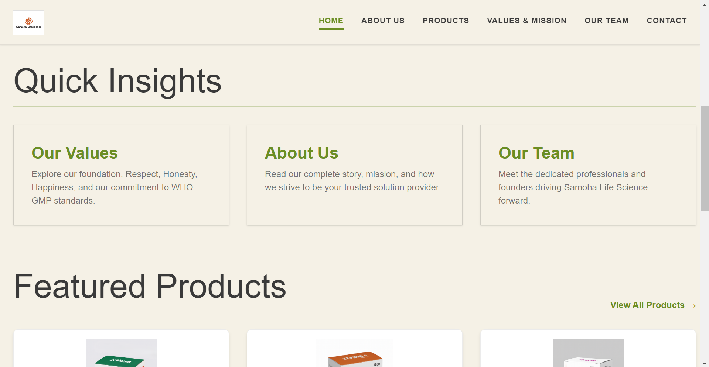
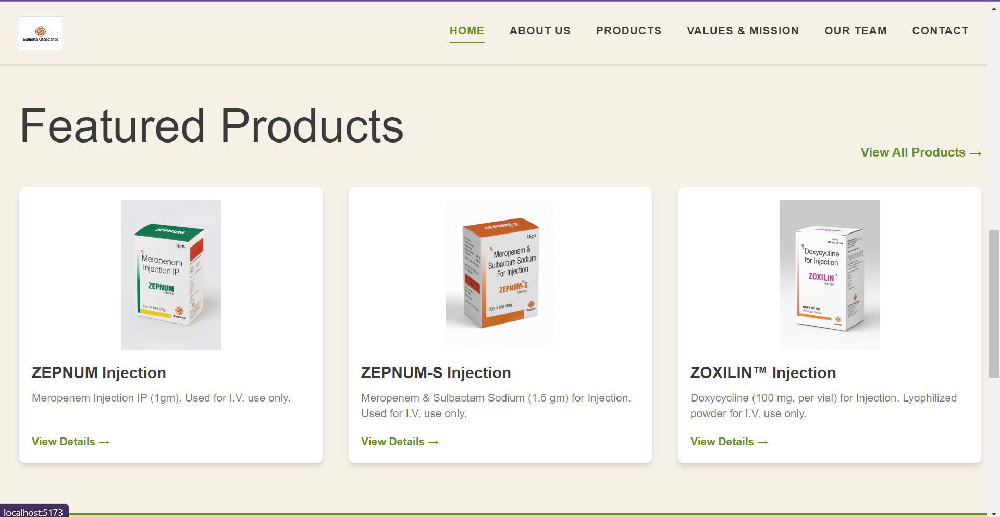
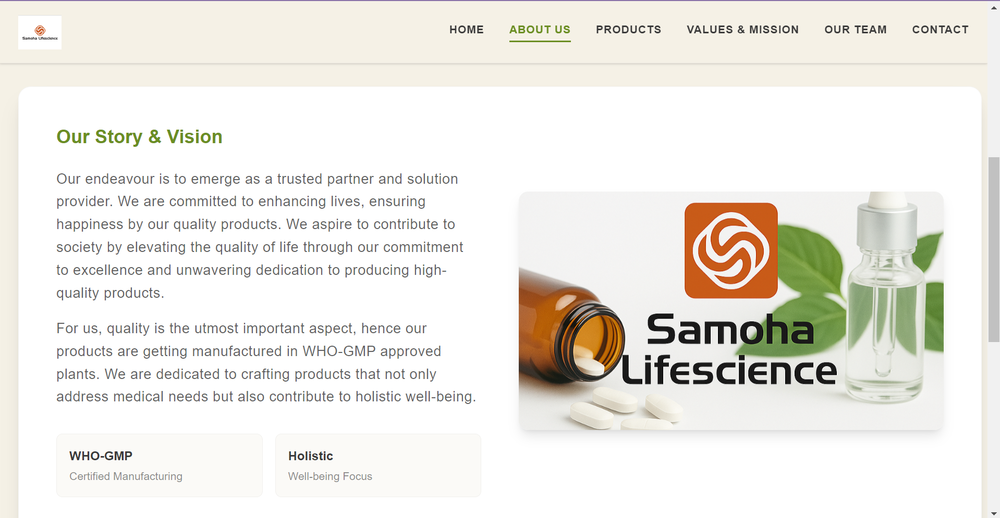
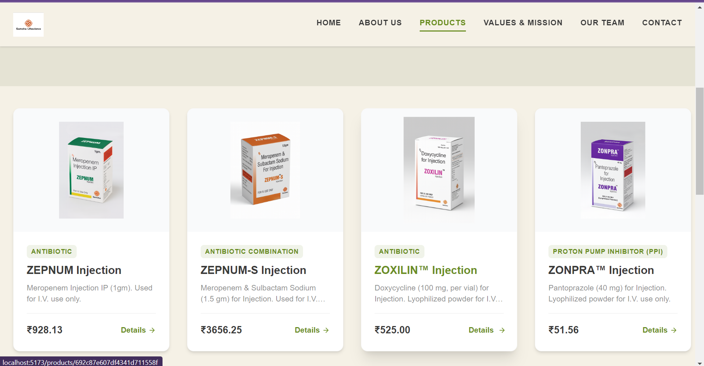
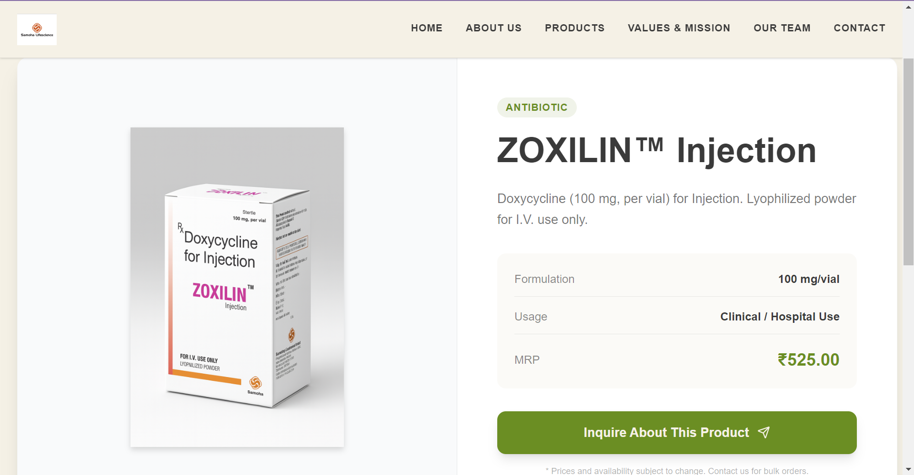
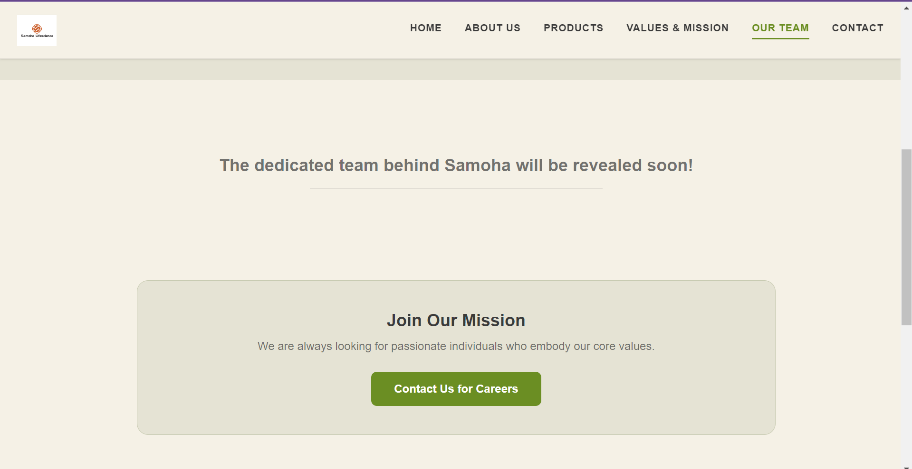
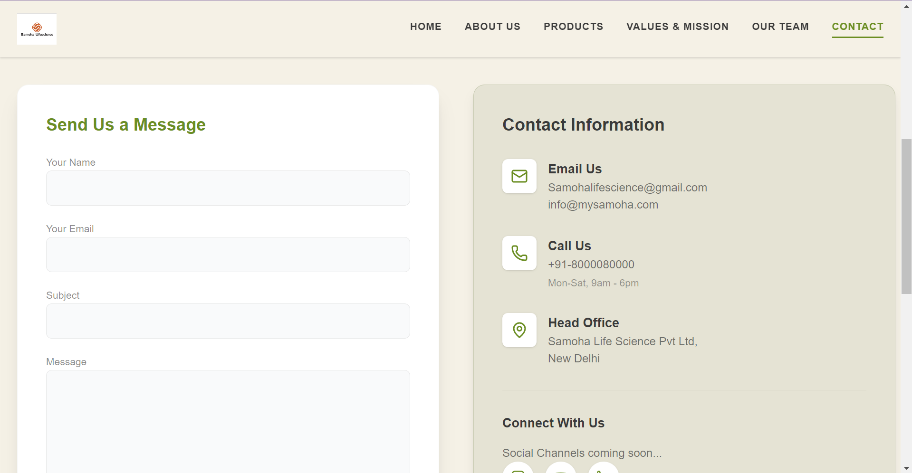

# 🌿 Ayurvedic Pharmaceutical Website

### Built with React (Vite), TailwindCSS, GSAP

This is a dynamic, elegant Ayurvedic pharmaceutical website built for startups looking to promote holistic wellness through ancient herbal remedies. Featuring smooth animations, responsive design, and a modern UI, this project merges traditional Ayurveda with cutting-edge web technology.

> ✨ A powerful blend of **React**, **TailwindCSS**, and **GSAP** animations to deliver an immersive and trustworthy experience for health-conscious users.

<br/>

## 📽️ Full Video Walkthrough

▶️ [Watch Demo Video](https://drive.google.com/file/d/1nSdnci7cIVuolkOGLkb2mQqppxyO709S/view?usp=sharing)


<div>
  
  <div style="display: flex; justify-content: space-between; margin: 20px 0;">
    
    
    
    
    
    
    
  </div>
</div>

---

## 🚀 Tech Stack

| Technology       | Description                                   |
| ---------------- | --------------------------------------------- |
| **React (Vite)** | Lightning-fast frontend development           |
| **Tailwind CSS** | Utility-first CSS framework for sleek styling |
| **GSAP**         | Scroll-based animations and transitions       |

---

## 📁 Features

- 🌱 Home page with immersive scroll-based herbal visuals
- 📖 About section narrating the journey of Ayurvedic healing
- 🌿 Product showcase with herbal medicines and supplement visuals
- ⚡ Animated hero section powered by GSAP
- 📞 Contact section for user queries and B2B partnerships

---

## 📦 Setup & Installation

```bash
git clone https://github.com/smreetyyadav/ayurveda-website.git
cd ayurveda-website
npm install
npm run dev

