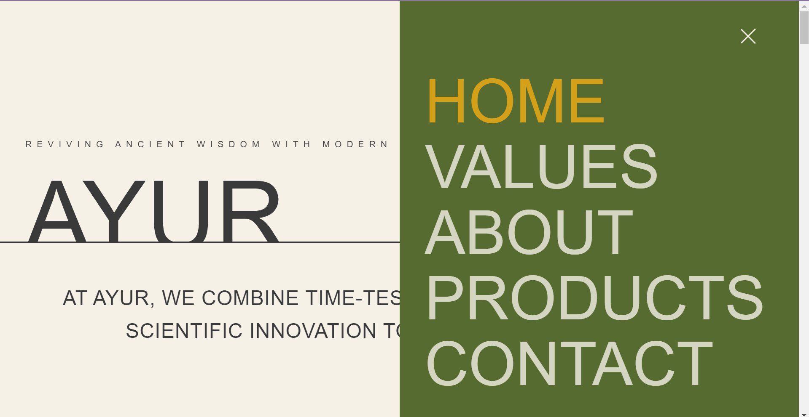
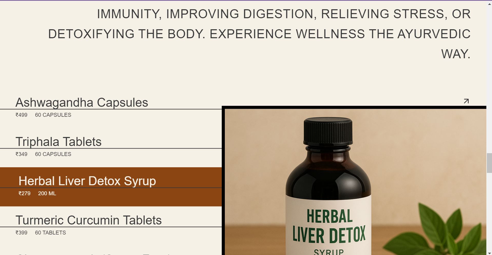
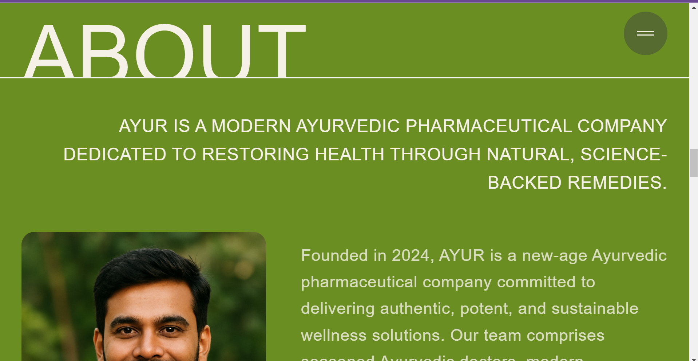
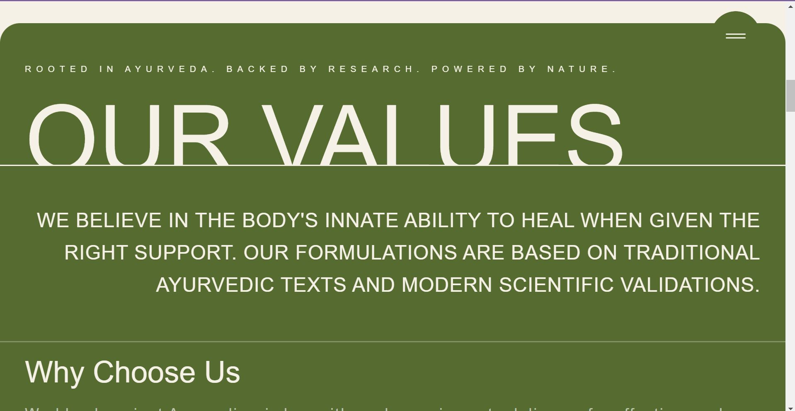

# 🌿 Samoha Life Science - Corporate Product Platform

### Built with React (Vite), TailwindCSS, GSAP, Node.js / Express, MongoDB Atlas / Mongoose

A full-stack, responsive, multi-page platform built for Samoha Life Science Pvt Ltd. This project showcases proficiency in the MERN stack (MongoDB, Express, React, Node.js), complex UI/UX design, and professional email authentication protocols.

> ✨ A robust MERN stack application featuring a dynamic product catalog, seamless routing, high-contrast UI, and reliable email communication via GoDaddy SMTP.

<br/>


## 📽️ Full Video Walkthrough

▶️ [Watch Demo Video](https://drive.google.com/file/d/1kRWXFWjJbU5iEVZaeVVGJfG-axPkMrdg/view?usp=sharing)


<div>
  
  <div style="display: flex; justify-content: space-between; margin: 20px 0;">
    
    
    
    
    
    
    
  </div>
</div>

---

## 🚀 Tech Stack

| Technology                   | Role          | Description                                                             |
| ---------------------------- | ------------- | ----------------------------------------------------------------------  |
| **React (Vite)**             | Frontend/UI   | Modular component architecture for a multi-page application (MPA).      |
| **Tailwind CSS**             | Styling       | Utility-first framework used for responsive design and visual polish.   |
| **Node.js / Express**        | Backend/API   | RESTful API development for data serving and contact logic.             |
| **MongoDB Atlas / Mongoose** | Database      | Cloud data persistence for dynamic product catalog.                     |
| **GSAP**                     | Animation     | Smooth, dynamic transitions and title entry animations.                 |
| **Nodemailer**               | Email Service | Handles SMTP communication via GoDaddy for reliable inquiry submission. |

---

## 🛠️ Project Structure

The repository is divided into two separate, linked directories:

| Folder | Technology | Description |
| :--- | :--- | :--- |
| **`Frontend`** | React, Vite, Tailwind CSS | The client-side application. Handles routing, data display, and form interaction. |
| **`Backend`** | Node.js, Express.js, Mongoose | The API server. Manages connections to MongoDB Atlas, serves product data, and handles email inquiries via SMTP. |

---

## 📁 Key Features

- 🌱 **MERN Stack Data:** Dynamic Product Catalog with live pricing and Cloudinary-hosted images.
- 📖 **Authenticated Inquiries:** Contact form securely sends emails using GoDaddy SMTP, complete with professional domain authentication.
- 🌿 **Multi-Page Routing:** Clean, seamless navigation across all corporate sections (`/about`, `/products`, `/team`).
- ⚡ **Unified UI/UX:** High-contrast, custom color scheme with smooth, animated title headers on every inner page.
- 📞 **Responsive Design:** Fully fluid and tested layout ensuring stability on all mobile devices.

---

## ⚙️ Local Setup Guide

### Prerequisites

1.  Node.js (LTS version) and npm installed.
2.  Access to a MongoDB Atlas cluster (Connection URI).
3.  Credentials for the `info@mysamoha.com` professional mailbox (password).

### A. Backend Setup (samoha-api)

1.  Navigate to the `Backend` directory:
    ```bash
    cd Backend
    ```
2.  Install dependencies:
    ```bash
    npm install
    ```
3.  **Configure Environment Variables:** Create a **`.env`** file (which is excluded from Git) and add your secrets:
    ```
    MONGODB_URI="[YOUR ATLAS CONNECTION STRING HERE]"
    PORT=5000
    
    EMAIL_USER="[YOUR EMAIL]"
    EMAIL_PASS="[INFO_MAILBOX_PASSWORD]"
    ```
4.  **Start the API Server:**
    ```bash
    node server.js
    ```
    (The server should connect to MongoDB and start listening on port 5000.)

### B. Frontend Setup (ayurveda)

1.  Open a new terminal and navigate to the `Frontend` directory:
    ```bash
    cd Frontend
    ```
2.  Install dependencies:
    ```bash
    npm install
    ```
3.  **Ensure API URL is Correct:** Verify that `API_BASE_URL` in files like `ProductsPage.jsx` is set to `http://localhost:5000/api/products`.
4.  **Run the Website:**
    ```bash
    npm run dev
    ```

The website will be available at `http://localhost:5173` (or similar port).

---

## 📷 Asset Management

Product images are hosted externally on **Cloudinary** and referenced via public URLs in the MongoDB database for scalability. Static assets (logo, fonts) are served from the `Frontend/public` directory.